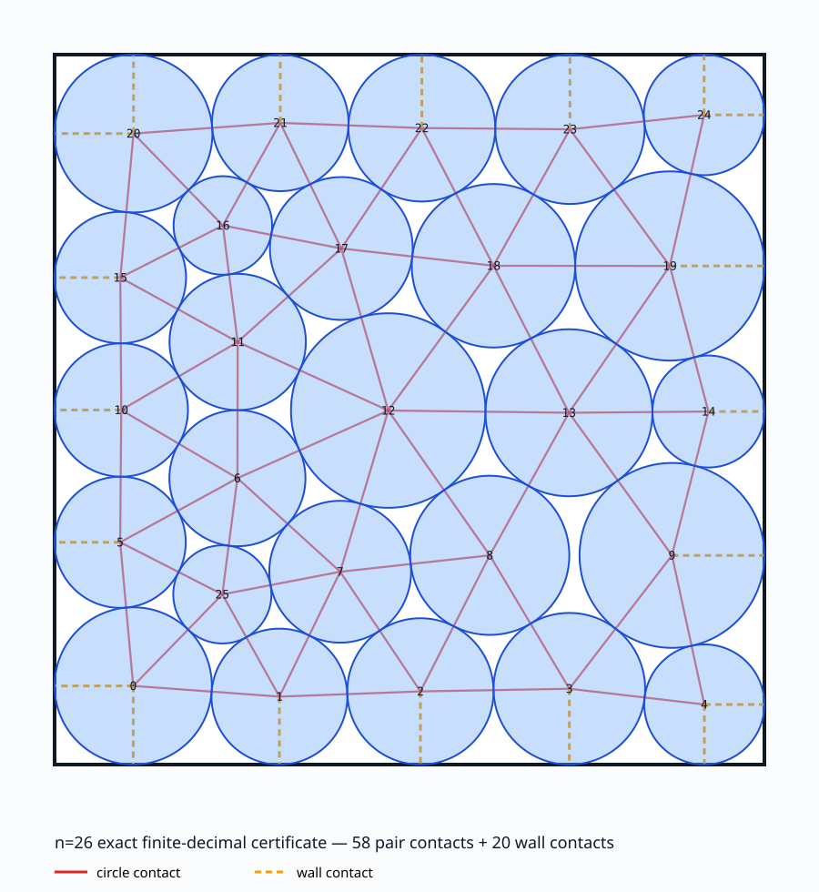

# Circle packing n=26: tolerance audit and exact certificate

This repository separates three different numerical contracts for the problem
of placing 26 variable-radius circles in the unit square while maximizing the
sum of their radii.

| Contract | Recomputed score | Meaning |
| --- | ---: | --- |
| tolerance `1e-6` | `2.63599872089287514` | Benchmark result under the public EurekAgent-style contract |
| tolerance `1e-10` | `2.63598308647338795` | Result under the internal `1e-10` contract |
| tolerance `0` | `2.635983084917607783186569485443481730396676798274474857745771129860703849334…` | Finite-decimal certificate verified as exact rationals |

The three numbers are **not interchangeable**.  The first two consume the
evaluator's tolerance and fail when checked at tolerance zero.  The third is a
strictly feasible lower-bound witness, but it is **not a proof of global
optimality** and is not claimed as a new numerical Packomania record.



## Reproduce the artifact

Python 3.12 is the reference environment.

```bash
python3 -m venv .venv
source .venv/bin/activate
python -m pip install --requirement requirements.lock
./verify_all.sh
```

The command verifies all 1,287 inequalities for the three primary contracts
using exact rational decisions, reruns the automated tests, regenerates the
audit tables, regenerates the contact-graph visualization, and updates the
SHA-256 manifest.

The core certificate verifier itself uses only Python's standard library.
NumPy and SciPy are required for the independently reconstructed contact solver
and continuation code.

## Rebuild the strict certificate

```bash
python scripts/refine_exact.py --output-dir results/rebuilt_exact
```

This starts from the published finite-decimal witness, reconstructs its 78
active contacts, solves the contact system, applies 120-digit Newton refinement,
rounds to 90 decimal places, and shrinks every radius conservatively before
writing a new certificate.

## Regenerate contact-release seeds

The original ChatGPT response attached the historical summaries and logs but
did not attach its temporary `contact_flip.py` module or any `.npz` seeds.  This
repository replaces that hidden dependency with `scripts/contact_graph.py` and
regenerates seeds from the certificate:

```bash
# all 78 one-contact releases
python scripts/run_search.py --depth 1

# evidence-aligned layered policy: 78 + 4×78 + 6×78 transitions
python scripts/run_search.py --depth 3 --max-bases 4,6
```

The new run is reproducible from published files.  It is a clean
reimplementation, not a claim of bit-for-bit identity with the unavailable
temporary sandbox state from the historical run.

The repository includes the regenerated root and all 78 first-layer `.npz`
seeds, their traces, and the layer summary under
`results/search_reproduction/`. Seed archives use a fixed ZIP timestamp, so a
clean regeneration is byte-reproducible rather than merely numerically
equivalent.

A complete clean rerun of layer 1 regenerated all 78 events and all 23
historical local-maximum classifications. There were no classification
disagreements; the largest endpoint-score difference was `3.32e-11`. The
machine-readable comparison is in `results/search_layer1_validation.json`.

The historical prose said “390 additional” second-layer transitions and called
the third layer partial. The attached logs are more precise: they contain 312
second-layer transitions (`4×78`) and all 468 planned third-layer transitions.
Thus 390 is the cumulative total through layers 1 and 2 (`78+312`), not 390
additional second-layer traces. `results/historical_search_counts.json` records
the line-by-line audit that corrects the earlier narrative.

## Repository map

- `data/tolerance_1e-6/`, `data/tolerance_1e-10/`, `data/exact/`: the three regimes, certificates, programs, and original model explanations.
- `scripts/verifier.py`: independent exact-rational verifier.
- `scripts/contact_graph.py`: replacement for the missing historical module.
- `scripts/refine_exact.py`: high-precision reconstruction and conservative exactification.
- `scripts/run_search.py`: deterministic contact-release search and seed generation.
- `data/audit/`: frozen public-artifact audit and its Spanish report.
- `data/provenance.json`: per-candidate source and license status.
- `results/audit_tables.md`: generated rankings under each separate tolerance.
- `docs/`: definitions, method, provenance, disclosure, and limitations.

## Claims that this repository supports

1. Each of the three included certificates passes its stated numerical contract.
2. The finite decimals in `data/exact/certificate.csv`, interpreted as exact rational numbers, satisfy all 429 geometric inequalities at tolerance zero.
3. In the frozen public corpus dated 2026-08-06, each primary certificate ranks first when compared only under its own tolerance.
4. The exact certificate reconstructs a 78-contact, full-rank stationary configuration with 58 pair contacts and 20 wall contacts.

The ranking statement is corpus-bounded.  It excludes private results and
published scores for which no complete witness was available.

Read [exactness](docs/EXACTNESS.md), [methodology](docs/METHODOLOGY.md),
[provenance](docs/PROVENANCE.md), and [limitations](docs/LIMITATIONS.md) before
citing the numerical claims.

## Citation and license

Citation metadata is in `CITATION.cff`.  Repository-authored code is released
under the MIT License.  External artifacts are not relicensed: only derived
audit metrics are retained when an upstream redistribution license was absent
or unclear.  See `data/provenance.json`.
